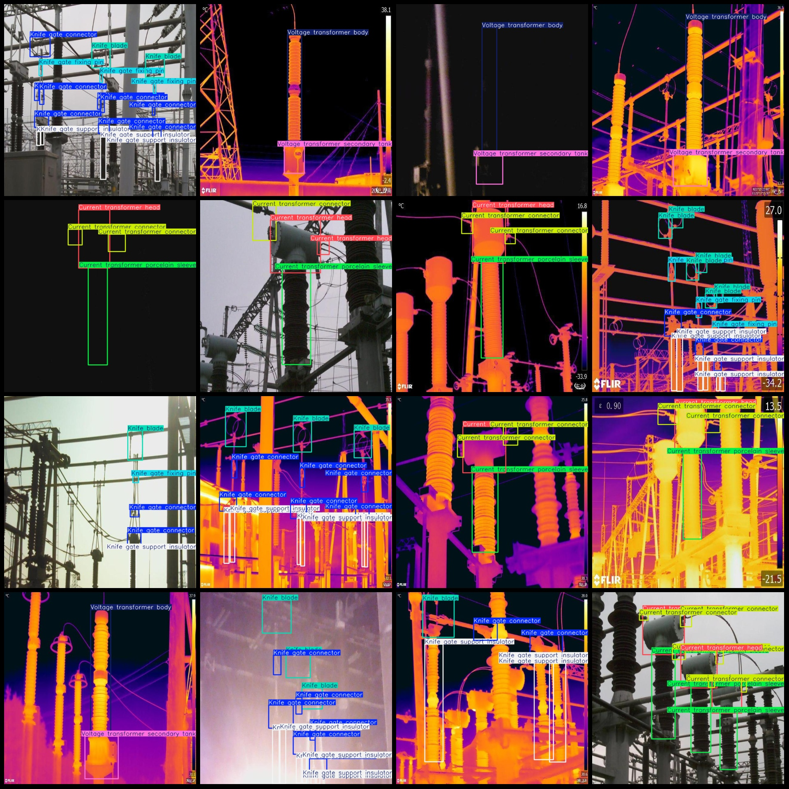
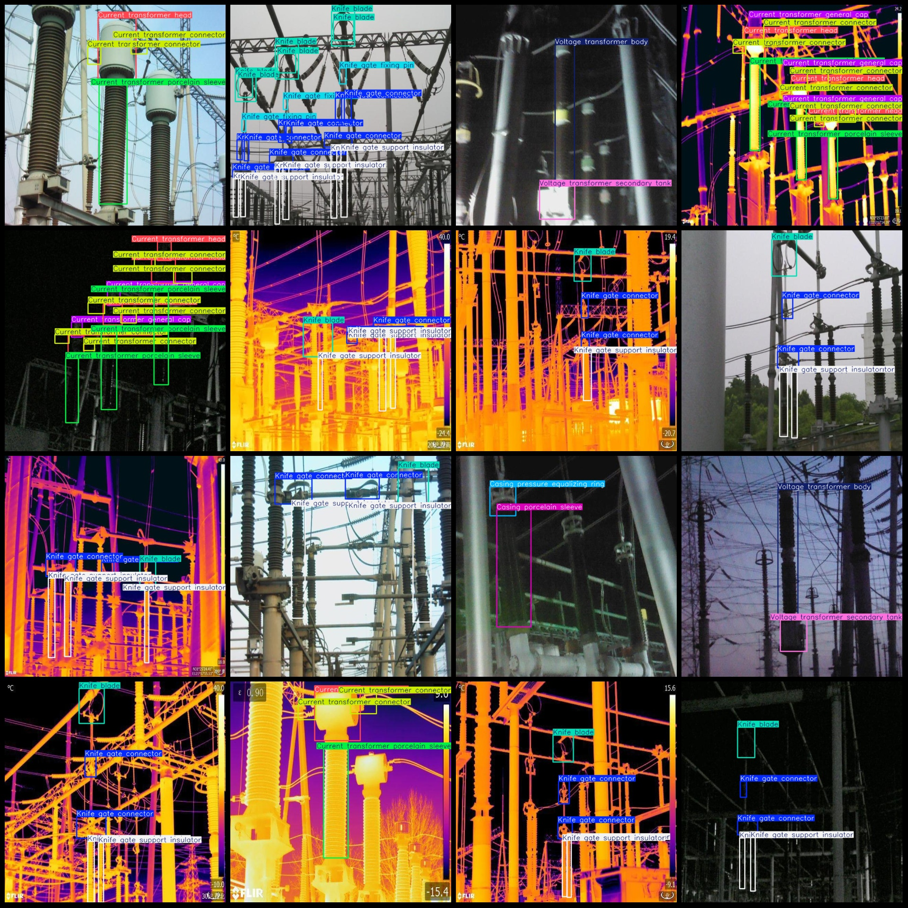

# Vision+Infrared dataset of 2354 images in 17 categories and 1177 pairs for switchgear, bushing, circuit breaker, voltage, current, transformer, lightning arrester, etc.

Dataset format: Pascal VOC format+YOLO format (txt files without split paths, only containing jpg images and corresponding VOC formatxml files and yolo formattxt files)

The number of images (number of jpg files): 2354
The number of XML files is 2354.
annotation count: 2354
annotationnumber of classes: 17
Annotation class names: ["Arrester body", "Arrester voltage equalizing ring", "Casing connector", "Casing general hat", "Casing porcelain sleeve", "Casing pressure equalizing ring", "Current transformer connector", "Current transformer general cap", "Current transformer head", "Current transformer porcelain sleeve", "Current transformer secondary tank", "Knife blade", "Knife gate connector", "Knife gate fixing pin", "Knife gate support insulator", "Voltage transformer body", "Voltage transformer secondary tank"]

The number of boxes labeled in each category:

Body of Arrestor Frames = 6
Voltage Equalizing Ring of Arrestor = 6
Casing Connector Frames = 48
General Hat of Casing = 56
Porcelain Sleeve of Casing = 158
Pressure Equalizing Ring of Casing = 106
Current Transformer Connectors = 2106
General Cap of Current Transformer = 414
Head of Current Transformer = 1040
Porcelain Sleeve of Current Transformer = 1134
Secondary Tank of Current Transformer = 100
Knife Blades = 1256
Knife Gate Connectors = 2346
Knife Gate Fixing Pins = 322
Knife Gate Support Insulators = 2410
Voltage transformer body box count = 880
Voltage transformer secondary tank box count = 844
Total number of frames: 13232

Number of images per category:

Arrester body images = 2
Arrester voltage equalizing ring (Leakage Current Reduction Ring)
Casing connector images = 36
Casing general hat images = 44
Casing porcelain sleeve images = 98
Casing pressure equalizing ring images = 58
The current transformer connector (current transformer connection piece) occupies 740 pictures.
Current transformer General Cap images = 210
Current transformer Head images = 650
Current transformer Porcelain Sleeve images = 738
Current transformer Secondary Tank images = 96
The number of images for Knife blade (slotted contact/blade) is 760.
Knife gate connector images = 770
Knife gate fixing pin images = 164
Knife gate support insulator images = 746
Voltage transformer body images = 738
Voltage transformer secondary tank images = 716

Image resolution: 640x640
Use annotation tool: labelImg
Annotation rules: Draw a rectangle around the category.
Important note: The dataset does not have a training validation test split, so you need to manually split it.
Special Notice: This dataset does not guarantee the accuracy of the trained model or the weight files.
Preview of the image:
## Images

Here is a pay link on Stripe ( https://buy.stripe.com/3cs8yP7sY87d0vu9AB ). Please contact me lonlonago@foxmail.com after funding $89, and I will send you a complete data files , thank you!

